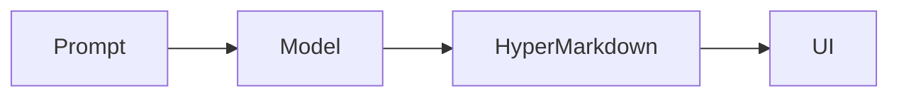

# Mermaid diagrams

The Mermaid plugin claims fenced blocks whose language is `mermaid`. Without
it, those fences remain ordinary readable code blocks.

## Install

```bash
npm install mermaid
```

## Configure

```tsx
import { mermaidPlugin } from "@aeven-ai/hypermarkdown/plugins/mermaid";

const plugins = {
  diagram: mermaidPlugin({
    theme: "neutral",
    fontFamily: "Inter",
  }),
};

<HyperMarkdown md={markdown} plugins={plugins} />
```

````markdown

````

## Lazy loading

Mermaid is dynamically imported on first use. A document without a diagram
never downloads the engine. During a stream, loading begins as soon as the
opening Mermaid fence is recognized, overlapping the rest of the diagram.

Use `preload` when a mounted view is very likely to render a diagram
immediately:

```tsx
<HyperMarkdown md={markdown} preload plugins={plugins} />
```

Only a configured diagram plugin is preloaded.

## Safe defaults

The factory defaults to Mermaid's strict security level and neutral theme.
`startOnLoad` stays disabled so Mermaid does not scan and mutate the page on
its own. Error rendering is suppressed while a diagram is incomplete, which
prevents half-written model output from painting an error graphic.

User configuration is merged over the regular defaults, while the settings
that keep Mermaid isolated from the page remain enforced.

## Controls

Finished and streaming diagrams provide source copy and fullscreen controls.
They can also be zoomed with the buttons, or by holding Ctrl (or ⌘) while
scrolling — which is what a trackpad pinch sends, so pinching zooms as well. A
plain scroll is left to the page, so a diagram under the cursor never traps it.
Panning works with a mouse, pen, or touch gesture, and the reset button
restores the original view.

```tsx
<HyperMarkdown
  md={markdown}
  plugins={plugins}
  controls={{
    diagram: { copy: true, fullscreen: true, panZoom: true },
  }}
/>
```

Pass `diagram: false` to disable every diagram control, or set only
`diagram.panZoom` to `false` to leave copy and fullscreen available.

## Keep the plugin stable

Create `mermaidPlugin()` once at module scope. Its closure retains the loaded
engine and shares an in-flight import between diagrams. Recreating it discards
that useful state.

## Related guides

- [Plugin overview](/docs/plugins)
- [Block controls](/docs/features/interactivity)
- [Security and sanitization](/docs/security)
